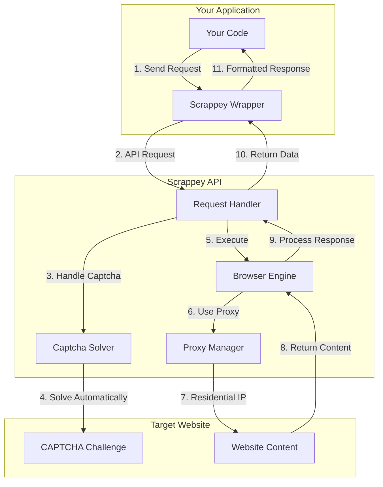

# Scrappey — Web Scraping API Wrapper

The official Node.js wrapper for the [Scrappey](https://scrappey.com) web scraping API. Render and retrieve fully-loaded web pages, run browser automation, and handle captchas — all through a single API.

[](https://www.npmjs.com/package/scrappey-wrapper)
[](https://opensource.org/licenses/MIT)

> **Responsible use:** This wrapper is intended for collecting publicly available data in compliance with applicable laws. See the [Disclaimer](#disclaimer).

## Features

- **Browser automation**: Full browser actions (click, type, scroll, execute JS)
- **Session management**: Persistent sessions with cookie and state management
- **All HTTP methods**: GET, POST, PUT, DELETE, PATCH
- **Proxy support**: Built-in residential proxies with country selection
- **Captcha handling**: Automatic captcha solving
- **Screenshots & video**: Capture screenshots and record browser sessions
- **TypeScript support**: Full TypeScript declarations included

## Pricing

Scrappey uses simple, pay-as-you-go pricing:

- **From €1 per 1,000 requests** (JS rendering + residential proxies)
- **Up to 200 concurrent requests** out of the box
- **30+ browser automation actions**
- **No monthly commitment** — pay only for what you use

## How It Works

Scrappey handles the infrastructure of page rendering, captcha solving, proxy routing, and session management behind a single API:



### Request Flow

1. **Your code** sends a request through the Scrappey wrapper
2. **Scrappey API** receives and processes the request
3. **Captcha solver** detects and solves captchas automatically
4. **Browser engine** executes browser actions if needed (click, type, scroll)
5. **Proxy manager** routes through residential proxies
6. **Target website** returns content
7. **Response** is formatted and returned to your application

### Use Cases

- **E-commerce**: Product data, prices, reviews
- **Social media**: Public profile data, posts, engagement metrics
- **Search engines**: SERP data, rankings
- **Real estate**: Property listings, prices, details
- **News & content**: Articles, headlines, metadata
- **API testing**: Test your own APIs from different IPs
- **Data aggregation**: Collect data from multiple sources

## Installation

```bash
npm install scrappey-wrapper
```

## Quick Start

```javascript
const Scrappey = require('scrappey-wrapper');

const scrappey = new Scrappey('YOUR_API_KEY');

// Basic GET request
const response = await scrappey.get({
    url: 'https://example.com'
});

console.log(response.solution.response);   // HTML content
console.log(response.solution.statusCode); // 200
```

## Request Modes

Scrappey supports two request modes:

| Mode | Description | Cost | Best For |
|------|-------------|------|----------|
| `browser` | Headless browser (default) | 1 + 0.2 balance/request | Complex pages, JS rendering, browser actions |
| `request` | HTTP library with TLS | 0.2 balance/request | Simple requests, speed-critical, cost-sensitive applications |

### Using Browser Mode (Default)

Browser mode uses a real headless browser, enabling full JavaScript execution and browser actions:

```javascript
const response = await scrappey.get({
    url: 'https://example.com',
    requestType: 'browser', // Default — can be omitted
    browserActions: [
        { type: 'click', cssSelector: '#button' },
        { type: 'wait', wait: 1000 }
    ]
});
```

### Using Request Mode (Faster & Cheaper)

Request mode uses an HTTP library with TLS fingerprinting — faster and cheaper for simple requests:

```javascript
const response = await scrappey.get({
    url: 'https://api.example.com/data',
    requestType: 'request' // HTTP mode — 5x cheaper
});
```

**Use `request` mode for:**
- API calls and JSON endpoints
- Simple HTML pages without heavy JavaScript
- High-volume collection where cost matters
- Speed-critical applications

**Use `browser` mode for:**
- Sites with JavaScript-rendered content
- Browser actions (click, type, scroll)
- Captcha solving

## Drop-in Replacement for Axios/Fetch

**New in v2.0.0**: Use Scrappey as a drop-in replacement for axios or fetch. Change your import and all requests automatically route through Scrappey, with rendering, captcha solving, and proxy support.

### Axios Drop-in

```javascript
// Before
import axios from 'axios';
const response = await axios.get('https://example.com');

// After — just change the import
import axios from 'scrappey-wrapper/axios';
axios.defaults.apiKey = 'YOUR_API_KEY';
const response = await axios.get('https://example.com');
```

**All axios methods work:**

```javascript
import axios from 'scrappey-wrapper/axios';

axios.defaults.apiKey = 'YOUR_API_KEY';

// GET request
const response = await axios.get('https://example.com', {
    headers: { 'Authorization': 'Bearer token' },
    params: { page: 1 }
});

// POST request
const response = await axios.post('https://api.example.com/submit', {
    name: 'John',
    email: 'john@example.com'
}, {
    headers: { 'Content-Type': 'application/json' }
});

// All standard axios options work
const response = await axios.get('https://example.com', {
    timeout: 5000,
    proxy: 'http://proxy:port',
    cookies: 'session=abc123',
    responseType: 'json'
});

// Scrappey-specific options also work
const response = await axios.get('https://example.com', {
    premiumProxy: true,
    automaticallySolveCaptchas: true
});
```

**Response format matches axios:**

```javascript
const response = await axios.get('https://example.com');
console.log(response.data);        // Response body
console.log(response.status);      // HTTP status code
console.log(response.statusText);  // Status text
console.log(response.headers);     // Response headers
console.log(response.scrappey);    // Additional Scrappey data (verified, cookies, etc.)
```

### Fetch Drop-in

```javascript
// Before
const response = await fetch('https://example.com');
const data = await response.json();

// After
import fetch from 'scrappey-wrapper/fetch';
fetch.configure({ apiKey: 'YOUR_API_KEY' });

const response = await fetch('https://example.com');
const data = await response.json();
```

**All fetch methods work:**

```javascript
import fetch from 'scrappey-wrapper/fetch';

fetch.configure({ apiKey: 'YOUR_API_KEY' });

// GET request
const response = await fetch('https://example.com', {
    headers: { 'Authorization': 'Bearer token' }
});

// POST request
const response = await fetch('https://api.example.com/submit', {
    method: 'POST',
    headers: { 'Content-Type': 'application/json' },
    body: JSON.stringify({ name: 'John', email: 'john@example.com' })
});

// Response methods
const text = await response.text();
const json = await response.json();
const blob = await response.blob();
const arrayBuffer = await response.arrayBuffer();
```

### Migration Guide

**From Axios:**
1. Change import: `import axios from 'axios'` → `import axios from 'scrappey-wrapper/axios'`
2. Set API key: `axios.defaults.apiKey = 'YOUR_API_KEY'`
3. That's it — your existing code works the same.

**From Fetch:**
1. Change import: `import fetch from 'node-fetch'` → `import fetch from 'scrappey-wrapper/fetch'`
2. Configure: `fetch.configure({ apiKey: 'YOUR_API_KEY' })`
3. All fetch calls now route through Scrappey.

### Configuration

**Axios:**

```javascript
import axios from 'scrappey-wrapper/axios';

// Set defaults
axios.defaults.apiKey = 'YOUR_API_KEY';
axios.defaults.premiumProxy = true;
axios.defaults.timeout = 60000;

// Or create a custom instance
const scrappeyAxios = axios.create({
    apiKey: 'YOUR_API_KEY',
    premiumProxy: true
});
```

**Fetch:**

```javascript
import fetch from 'scrappey-wrapper/fetch';

fetch.configure({
    apiKey: 'YOUR_API_KEY',
    premiumProxy: true,
    timeout: 60000
});
```

### Supported Options

All standard axios/fetch options are supported:
- `headers` → `customHeaders`
- `data` / `body` → `postData`
- `params` → URL query string
- `timeout` → `timeout`
- `proxy` → `proxy`
- `cookies` → `cookies` or `cookiejar`
- `responseType: 'json'` → uses `innerText` for JSON

Plus Scrappey-specific options:
- `automaticallySolveCaptchas`, `alwaysLoad`
- `browserActions`, `screenshot`, `video`
- `session`, `premiumProxy`, `proxyCountry`
- And many more

### Session Management

Both adapters support Scrappey session management:

```javascript
// Axios
import axios from 'scrappey-wrapper/axios';
axios.defaults.apiKey = 'YOUR_API_KEY';

const session = await axios.createSession();
const sessionId = session.session;

await axios.get('https://example.com', { session: sessionId });
await axios.destroySession(sessionId);

// Fetch
import fetch from 'scrappey-wrapper/fetch';
fetch.configure({ apiKey: 'YOUR_API_KEY' });

const session = await fetch.createSession();
const sessionId = session.session;

await fetch('https://example.com', { session: sessionId });
await fetch.destroySession(sessionId);
```

## API Reference

### Constructor

```javascript
const scrappey = new Scrappey(apiKey, options);
```

| Parameter | Type | Description |
|-----------|------|-------------|
| `apiKey` | `string` | Your Scrappey API key (required) |
| `options.baseUrl` | `string` | Custom API base URL (optional) |
| `options.timeout` | `number` | Default timeout in ms (default: 300000) |

### HTTP Methods

#### GET Request

```javascript
const response = await scrappey.get({
    url: 'https://example.com',
    session: 'optional-session-id',
    // ... other options
});
```

#### POST Request

```javascript
const response = await scrappey.post({
    url: 'https://api.example.com/submit',
    postData: {
        name: 'John Doe',
        email: 'john@example.com'
    },
    customHeaders: {
        'content-type': 'application/json'
    }
});
```

#### PUT, DELETE, PATCH

```javascript
await scrappey.put({ url, postData, ...options });
await scrappey.delete({ url, ...options });
await scrappey.patch({ url, postData, ...options });
```

### Session Management

```javascript
// Create a session
const session = await scrappey.createSession({
    proxyCountry: 'UnitedStates',
    // proxy: 'http://user:pass@ip:port'
});
const sessionId = session.session;

// Use the session
await scrappey.get({
    url: 'https://example.com',
    session: sessionId
});

// Check if a session is active
const status = await scrappey.isSessionActive(sessionId);

// List all sessions
const sessions = await scrappey.listSessions(userId);

// Destroy session when done
await scrappey.destroySession(sessionId);
```

### Browser Actions

```javascript
const response = await scrappey.get({
    url: 'https://example.com/login',
    browserActions: [
        { type: 'wait_for_selector', cssSelector: '#login-form' },
        { type: 'type', cssSelector: '#username', text: 'myuser' },
        { type: 'type', cssSelector: '#password', text: 'mypassword' },
        { type: 'click', cssSelector: '#submit', waitForSelector: '.dashboard' },
        { type: 'execute_js', code: 'document.querySelector(".user-info").innerText' }
    ]
});

// Access JS execution results
console.log(response.solution.javascriptReturn[0]);
```

#### Available Actions

| Action | Description |
|--------|-------------|
| `click` | Click on an element |
| `type` | Type text into an input |
| `goto` | Navigate to a URL |
| `wait` | Wait for milliseconds |
| `wait_for_selector` | Wait for an element to appear |
| `wait_for_function` | Wait for a JS condition |
| `wait_for_load_state` | Wait for page load state |
| `wait_for_cookie` | Wait for a cookie to be set |
| `execute_js` | Execute JavaScript |
| `scroll` | Scroll to element or bottom |
| `hover` | Hover over an element |
| `keyboard` | Press keyboard keys |
| `dropdown` | Select a dropdown option |
| `switch_iframe` | Switch to iframe context |
| `set_viewport` | Set viewport size |
| `if` | Conditional actions |
| `while` | Loop actions |
| `solve_captcha` | Solve a captcha |

### Captcha Solving

```javascript
// Automatic captcha solving
const response = await scrappey.get({
    url: 'https://example.com',
    automaticallySolveCaptchas: true
});

// Manual captcha solving with a browser action
const response = await scrappey.get({
    url: 'https://example.com',
    browserActions: [
        {
            type: 'solve_captcha',
            captchaData: {
                sitekey: 'SITE_KEY_HERE',
                cssSelector: '.captcha-widget'
            }
        }
    ]
});
```

### Screenshots & Video

```javascript
const response = await scrappey.get({
    url: 'https://example.com',
    screenshot: true,
    screenshotWidth: 1920,
    screenshotHeight: 1080,
    video: true
});

const screenshot = response.solution.screenshot; // Base64
const videoUrl = response.solution.videoUrl;
```

### Data Extraction

```javascript
const response = await scrappey.get({
    url: 'https://example.com',
    cssSelector: '.product-title',
    innerText: true,
    includeLinks: true,
    includeImages: true,
    regex: 'price: \\$([0-9.]+)'
});
```

### Request Interception

```javascript
const response = await scrappey.get({
    url: 'https://example.com',
    interceptFetchRequest: '/api/data',
    abortOnDetection: ['analytics', 'tracking', 'ads'],
    whitelistedDomains: ['example.com', 'cdn.example.com'],
    blackListedDomains: ['ads.com']
});

console.log(response.solution.interceptFetchRequestResponse);
```

## Configuration Options

| Option | Type | Description |
|--------|------|-------------|
| `url` | `string` | Target URL (required) |
| `session` | `string` | Session ID for session reuse |
| `proxy` | `string` | Proxy string (`http://user:pass@ip:port`) |
| `proxyCountry` | `string` | Proxy country (e.g., "UnitedStates") |
| `premiumProxy` | `boolean` | Use premium proxy pool |
| `mobileProxy` | `boolean` | Use mobile proxy pool |
| `postData` | `object/string` | POST/PUT/PATCH request data |
| `customHeaders` | `object` | Custom HTTP headers |
| `cookies` | `string` | Cookie string to set |
| `cookiejar` | `array` | Cookie jar array |
| `localStorage` | `object` | LocalStorage data to set |
| `browserActions` | `array` | Browser actions to execute |
| `automaticallySolveCaptchas` | `boolean` | Auto-solve captchas |
| `cssSelector` | `string` | Extract content by CSS selector |
| `innerText` | `boolean` | Include page text content |
| `includeLinks` | `boolean` | Include all page links |
| `includeImages` | `boolean` | Include all page images |
| `screenshot` | `boolean` | Capture screenshot |
| `video` | `boolean` | Record video |
| `pdf` | `boolean` | Generate PDF |
| `filter` | `array` | Filter response fields |
| `timeout` | `number` | Request timeout (ms) |

## Response Structure

```javascript
{
    solution: {
        verified: true,              // Request verification status
        response: '<html>...',       // HTML content
        statusCode: 200,             // HTTP status code
        currentUrl: 'https://...',   // Final URL after redirects
        userAgent: 'Mozilla/5.0...', // User agent used
        cookies: [...],              // Array of cookies
        cookieString: '...',         // Cookie string
        responseHeaders: {...},      // Response headers
        innerText: '...',            // Page text content
        screenshot: 'base64...',     // Base64 screenshot
        screenshotUrl: 'https://...',// Screenshot URL
        videoUrl: 'https://...',     // Video URL
        javascriptReturn: [...],     // JS execution results
    },
    timeElapsed: 1234,               // Request time (ms)
    data: 'success',                 // 'success' or 'error'
    session: 'session-id',           // Session ID
    error: '...',                    // Error message (if failed)
}
```

## Error Handling

```javascript
try {
    const response = await scrappey.get({ url: 'https://example.com' });

    if (response.data === 'error') {
        console.error('Error:', response.error);
        // See: https://wiki.scrappey.com/getting-started
    }
} catch (error) {
    console.error('Request failed:', error.message);
}
```

## Examples

Multi-language examples are available in the [examples](./examples) directory:

- **Node.js**: [examples/nodejs](./examples/nodejs)
- **TypeScript**: [examples/typescript](./examples/typescript)
- **Python**: [examples/python](./examples/python)
- **Go**: [examples/go](./examples/go)
- **C#**: [examples/csharp](./examples/csharp)
- **PHP**: [examples/php](./examples/php)
- **Java**: [examples/java](./examples/java)
- **Ruby**: [examples/ruby](./examples/ruby)
- **Rust**: [examples/rust](./examples/rust)
- **cURL**: [examples/curl](./examples/curl)

## TypeScript

Full TypeScript support is included:

```typescript
import Scrappey = require('scrappey-wrapper');

const scrappey = new Scrappey('API_KEY');

const response = await scrappey.get({
    url: 'https://example.com',
    browserActions: [
        { type: 'execute_js', code: 'document.title' }
    ]
});

console.log(response.solution.statusCode); // Fully typed
```

## For AI / LLM Agents

- **Package:** `scrappey-wrapper` (Node.js); install via `npm install scrappey-wrapper`.
- **Purpose:** Send HTTP requests through the Scrappey API to render and retrieve web pages, run browser automation, and solve captchas.
- **Auth:** API key passed to `new Scrappey('YOUR_API_KEY')`, or `axios.defaults.apiKey` / `fetch.configure({ apiKey })` for the drop-in adapters.
- **Core call:** `await scrappey.get({ url })` → returns `response.solution.response` (HTML) and `response.solution.statusCode`.
- **Modes:** `requestType: 'browser'` (default, full rendering) or `'request'` (HTTP+TLS, cheaper/faster).
- **Key options:** `automaticallySolveCaptchas`, `browserActions`, `session`, `premiumProxy`, `proxyCountry`, `screenshot`, `cssSelector`.
- **Drop-in adapters:** `scrappey-wrapper/axios` and `scrappey-wrapper/fetch` mirror the axios/fetch APIs.
- **Docs:** https://wiki.scrappey.com
- **Intended use:** Collecting publicly available data in line with applicable law and each target site's Terms of Service.

## Links

- **Website**: [https://scrappey.com](https://scrappey.com)
- **Documentation**: [https://wiki.scrappey.com](https://wiki.scrappey.com)
- **Request Builder**: [https://app.scrappey.com/#/builder](https://app.scrappey.com/#/builder)
- **GitHub**: [https://github.com/pim97/scrappey.js](https://github.com/pim97/scrappey.js)
- **NPM**: [https://www.npmjs.com/package/scrappey-wrapper](https://www.npmjs.com/package/scrappey-wrapper)

## License

This project is licensed under the MIT License — see the [LICENSE](LICENSE) file for details.

## Disclaimer

Ensure your web scraping activities comply with each website's Terms of Service and applicable legal regulations. Scrappey is not responsible for misuse of the library. Use it responsibly and respect website policies, `robots.txt`, and data-privacy laws.
